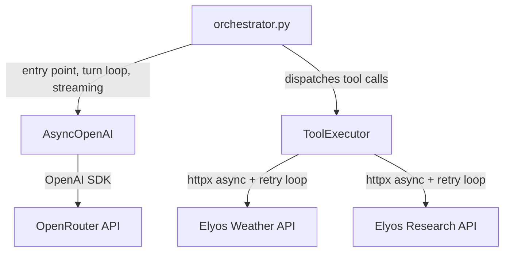
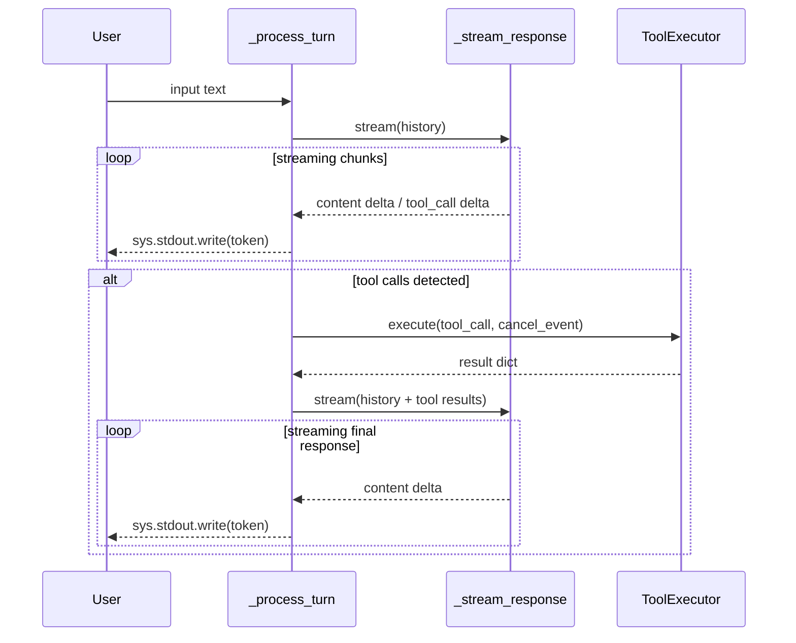
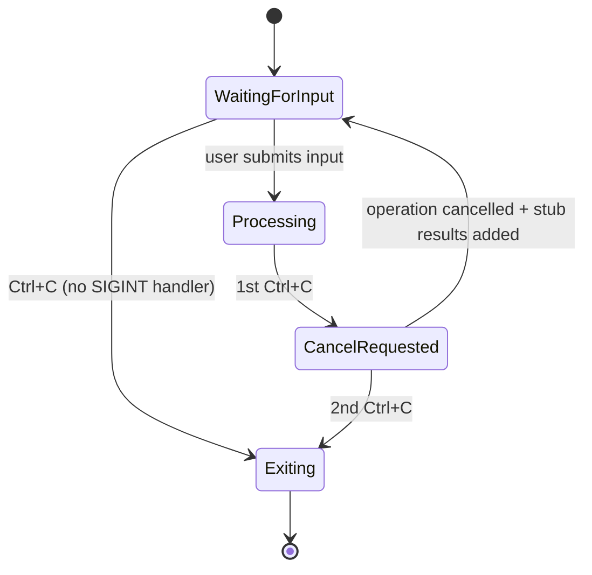
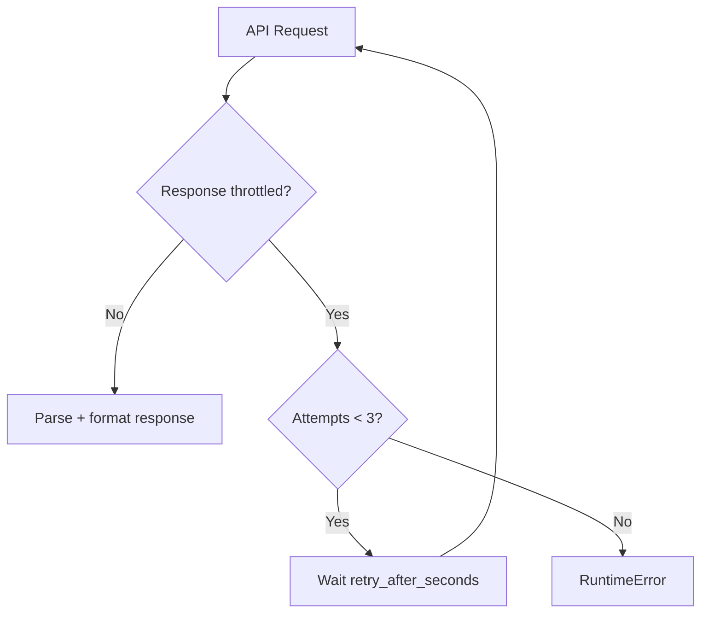
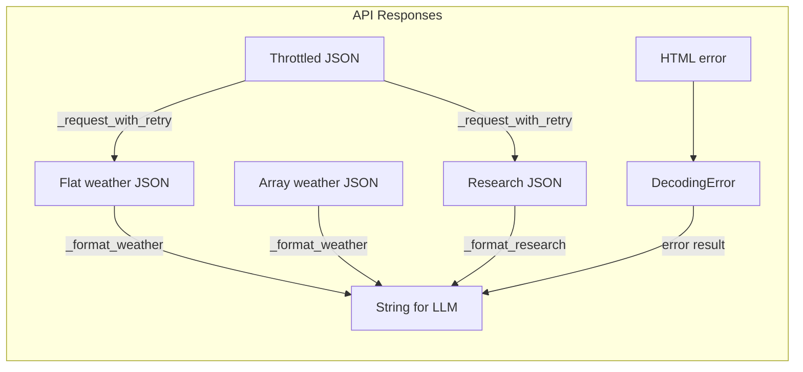

# Architecture

## Overview

The application is structured as two modules: `orchestrator.py` handles the conversation loop, LLM streaming, and cancellation; `tools.py` handles API calls, retry logic, and response formatting.

## Module Responsibilities

| Module           | Role                                                        | Stateful? |
| ---------------- | ----------------------------------------------------------- | --------- |
| `orchestrator.py`| Entry point, logging, turn lifecycle, LLM streaming, cancel | Yes       |
| `tools.py`       | API calls, retry loop, cancellable requests, formatting     | No        |

## Turn Lifecycle

## Cancellation Flow

The signal handler is context-dependent:

- **During input**: No custom SIGINT handler — `loop.add_reader(stdin)` races against `cancel_event.wait()`. Ctrl+C sets the cancel event, `_read_input()` returns `None`, and the app exits.
- **During processing**: Custom handler is installed. 1st Ctrl+C sets `cancel_event`; 2nd sets `should_exit`.
- **During HTTP requests**: `_race_with_cancel()` races the httpx coroutine against `cancel_event` via `asyncio.wait(FIRST_COMPLETED)`, so cancellation is instant even during slow API calls.
- **On cleanup**: Signal handler is removed before `asyncio.run()` shutdown to avoid stale handlers.

The cancel event is cleared at the start of each new turn.

### Post-cancellation history consistency

When tool calls are cancelled, stub `[cancelled by user]` tool messages are added to the history for every pending tool call. This prevents the LLM from rejecting the next request due to missing tool responses (the OpenAI API requires every `tool_call_id` to have a matching tool message).

### Why `add_reader` instead of `asyncio.to_thread(input)`?

Using `asyncio.to_thread(input)` spawns a thread that blocks on `input()`. When Ctrl+C fires, the thread can't be interrupted — it stays alive until the user presses Enter. This causes `asyncio.run()` to hang during executor shutdown (up to 10s timeout). `loop.add_reader(stdin)` avoids threads entirely, keeping shutdown instant.

## Retry Strategy

Retry is handled by `_request_with_retry`, a simple loop:

- **Trigger**: API returns `status: "throttled"` in JSON (HTTP 200)
- **Wait**: Reads `retry_after_seconds` from the throttled response (capped at 15s)
- **Stop**: After 3 attempts
- **On exhaustion**: Raises `RuntimeError` with retry guidance
- **Cancellation**: Each wait is cancellable via `_wait_or_cancel`

## Data Flow

## Key Design Decisions

1. **Flat functions over classes** — `_process_turn`, `_stream_response`, `_execute_tools` are plain async functions. State is just the `history` list and `cancel_event`, threaded through arguments.
2. **Cancel via asyncio.Event** — shared across the call chain, checked cooperatively. HTTP requests are raced against the event for instant cancellation.
3. **Dict-based formatting** — `_format_weather()` handles both flat and array API schemas with dict access. No Pydantic models needed for two simple response shapes.
4. **Simple retry loop** — `_request_with_retry` reads `retry_after_seconds` from the throttled response, sleeps (cancellably), and retries. Three attempts, capped at 15s wait.
5. **Content-type guard** — `_request()` checks for `application/json` before parsing, handling infrastructure-level HTML errors (e.g., unicode input causing Cloud Run 400).
6. **History integrity on cancel** — stub tool results ensure the conversation history is always valid, preventing LLM 400 errors after interrupted tool calls.
7. **File-only logging** — DEBUG-level logs to timestamped session files, with third-party loggers silenced to WARNING. No console noise.
