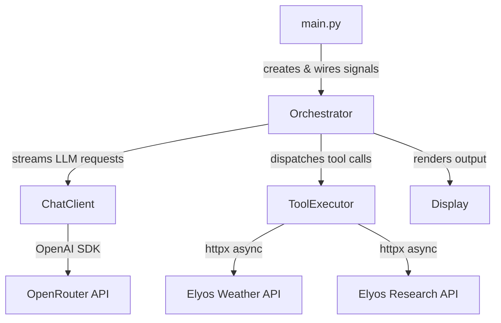
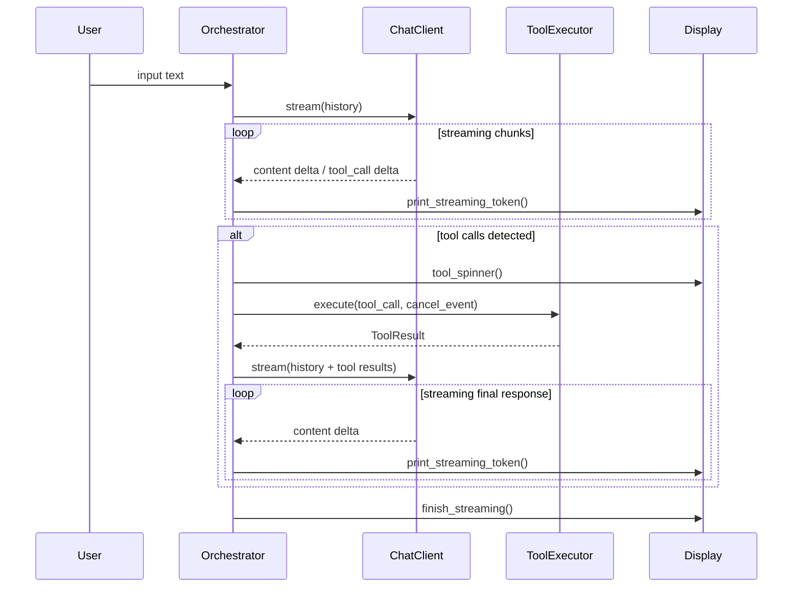
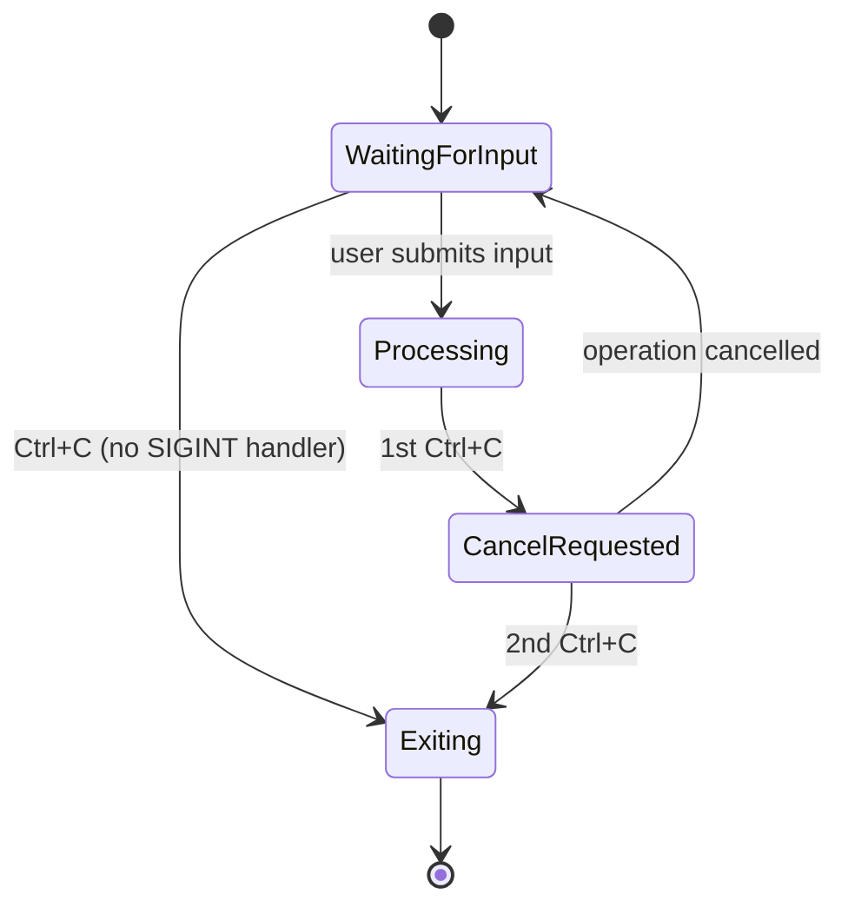
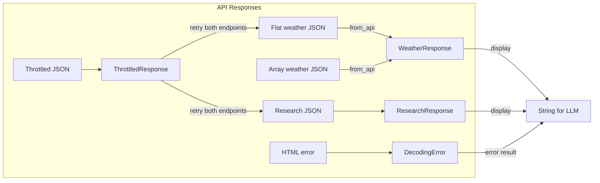

# Architecture

## Overview

The application follows an **orchestrator pattern** where a central coordinator manages the turn lifecycle, delegating to stateless workers for LLM interaction and tool execution.

## Module Responsibilities

| Module | Role | Stateful? |
|--------|------|-----------|
| `main.py` | Entry point, asyncio event loop, SIGINT wiring | No |
| `orchestrator.py` | Turn lifecycle, conversation history, cancellation coordination | Yes (history, cancel state) |
| `chat.py` | LLM streaming via OpenRouter | No |
| `tools.py` | API calls with retry, quirk handling, cancellation | No |
| `models.py` | Pydantic models for API responses, settings, tool results | No |
| `display.py` | Streaming output, spinners, styled messages | No |

## Turn Lifecycle

## Cancellation Flow

The signal handler is context-dependent:
- **During input**: No custom SIGINT handler — `loop.add_reader(stdin)` races against `cancel_event.wait()`. Ctrl+C sets the cancel event, `_read_input()` returns `None`, and the app exits.
- **During processing**: Custom handler is installed. 1st Ctrl+C sets `cancel_event`; 2nd sets `should_exit`.
- **On cleanup**: Signal handler is removed before `asyncio.run()` shutdown to avoid stale handlers.

The cancel event is cleared at the start of each new turn.

### Why `add_reader` instead of `asyncio.to_thread(input)`?

Using `asyncio.to_thread(input)` spawns a thread that blocks on `input()`. When Ctrl+C fires, the thread can't be interrupted — it stays alive until the user presses Enter. This causes `asyncio.run()` to hang during executor shutdown (up to 10s timeout). `loop.add_reader(stdin)` avoids threads entirely, keeping shutdown instant.

## Data Flow

Note: Both weather and research endpoints can return throttled responses (HTTP 200 with `status: "throttled"`). The retry logic is shared.

## Key Design Decisions

1. **Orchestrator owns all state** — ChatClient and ToolExecutor are stateless workers. This makes the system easy to reason about and test.
2. **Cancel via asyncio.Event** — shared between orchestrator and tool executor, checked cooperatively. No thread interruption or process killing.
3. **Pydantic normalization** — `WeatherResponse.from_api()` handles the non-deterministic API schemas at the boundary, so downstream code always sees a consistent model.
4. **Retry with respect** — throttle retries (both endpoints) use the server's `retry_after_seconds`, not arbitrary backoff. The sleep is cancellable.
5. **Content-type guard** — `_request()` checks for `application/json` before parsing, handling infrastructure-level HTML errors (e.g., unicode input → Cloud Run 400).
