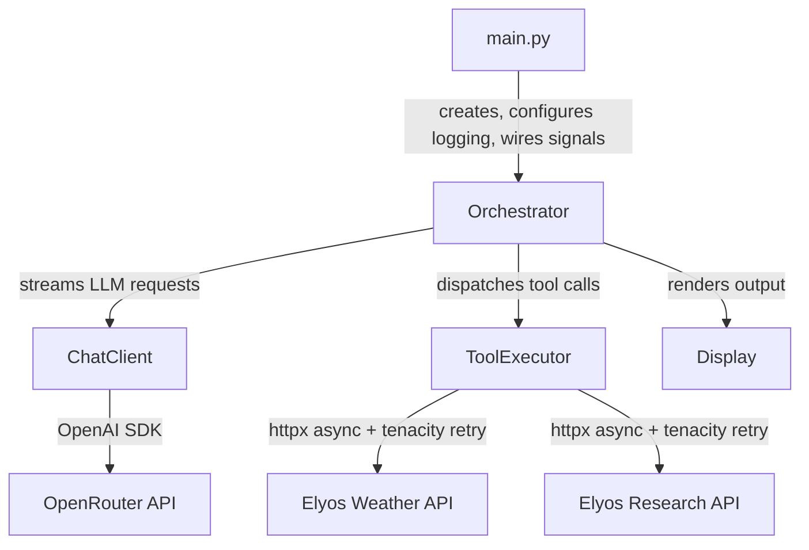
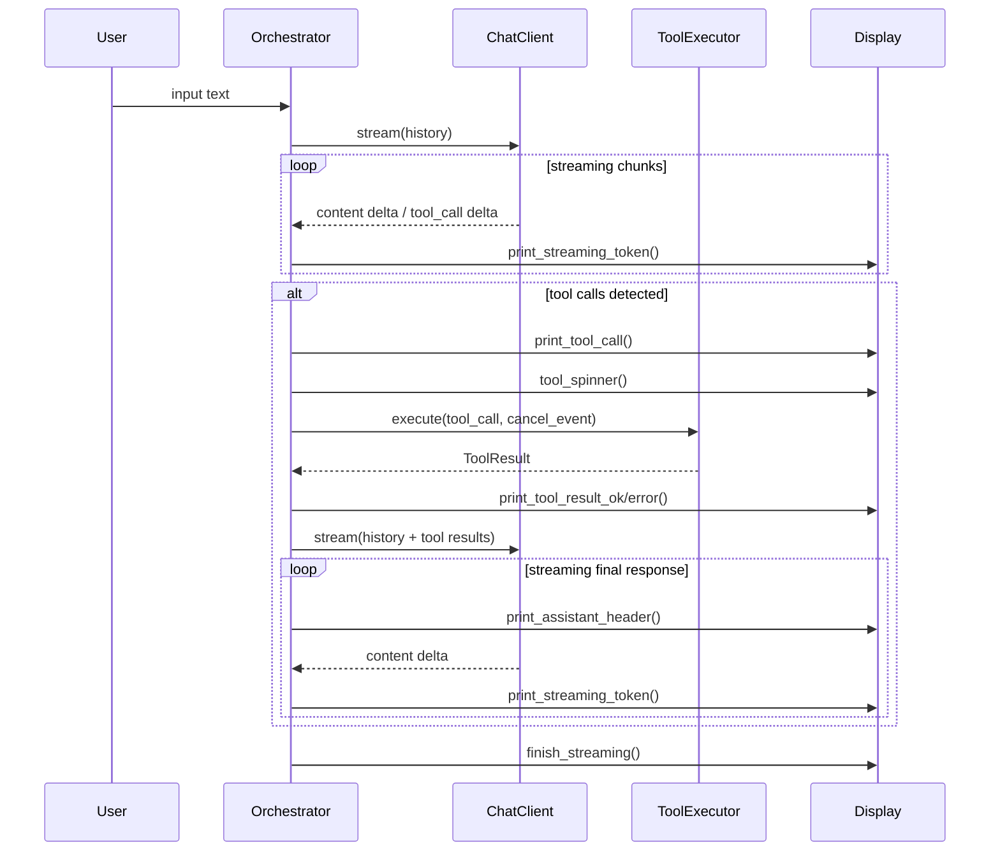
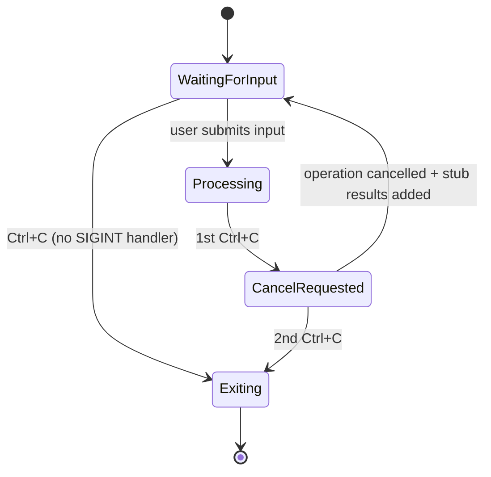
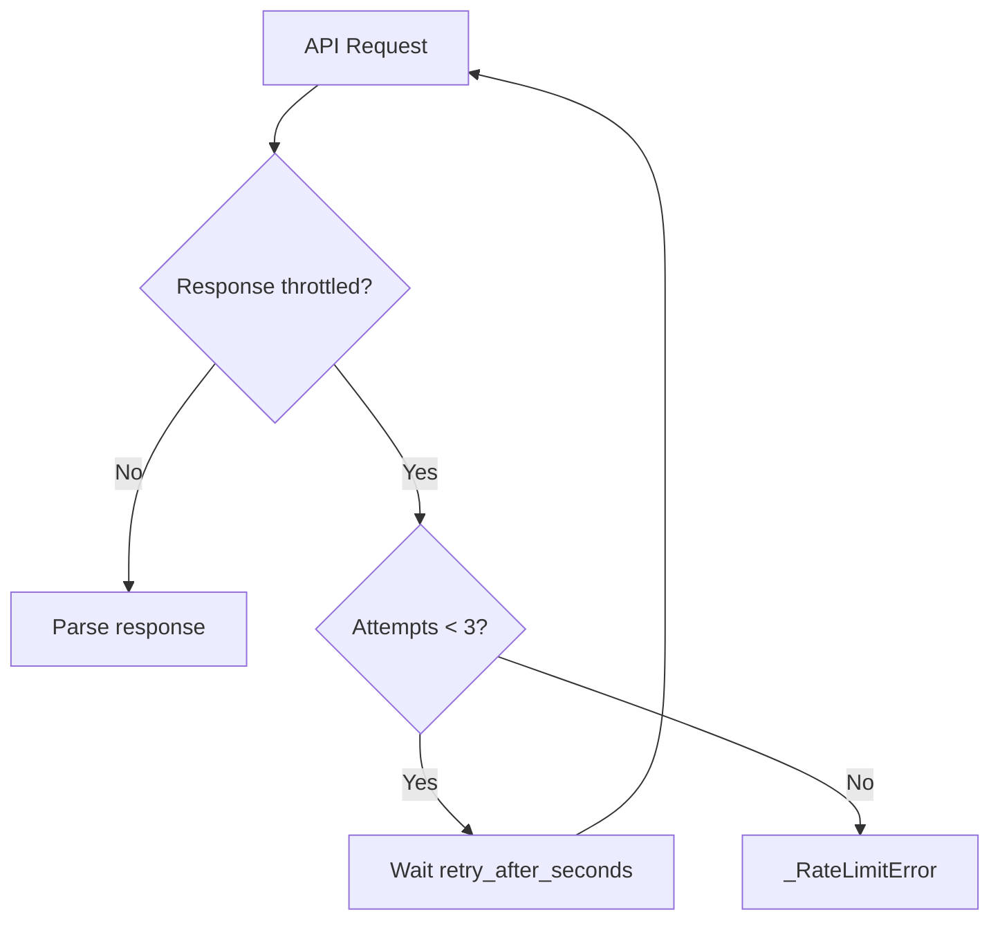

# Architecture

## Overview

The application follows an **orchestrator pattern** where a central coordinator manages the turn lifecycle, delegating to stateless workers for LLM interaction and tool execution.



## Module Responsibilities

| Module           | Role                                                    | Stateful? |
| ---------------- | ------------------------------------------------------- | --------- |
| `main.py`        | Entry point, logging config, asyncio loop, SIGINT wiring | No        |
| `orchestrator.py`| Turn lifecycle, conversation history, cancellation       | Yes       |
| `chat.py`        | LLM streaming via OpenRouter                            | No        |
| `tools.py`       | API calls, tenacity retry, cancellable requests          | No        |
| `models.py`      | Pydantic models for API responses, settings, tool results| No        |
| `display.py`     | Themed output (rich), spinners, tool indicators          | No        |

## Turn Lifecycle



## Cancellation Flow



The signal handler is context-dependent:

- **During input**: No custom SIGINT handler — `loop.add_reader(stdin)` races against `cancel_event.wait()`. Ctrl+C sets the cancel event, `_read_input()` returns `None`, and the app exits.
- **During processing**: Custom handler is installed. 1st Ctrl+C sets `cancel_event`; 2nd sets `should_exit`.
- **During HTTP requests**: `_cancellable_request()` races the httpx coroutine against `cancel_event` via `asyncio.wait(FIRST_COMPLETED)`, so cancellation is instant even during slow API calls.
- **On cleanup**: Signal handler is removed before `asyncio.run()` shutdown to avoid stale handlers.

The cancel event is cleared at the start of each new turn.

### Post-cancellation history consistency

When tool calls are cancelled, stub `[cancelled by user]` tool messages are added to the history for every pending tool call. This prevents the LLM from rejecting the next request due to missing tool responses (the OpenAI API requires every `tool_call_id` to have a matching tool message).

### Why `add_reader` instead of `asyncio.to_thread(input)`?

Using `asyncio.to_thread(input)` spawns a thread that blocks on `input()`. When Ctrl+C fires, the thread can't be interrupted — it stays alive until the user presses Enter. This causes `asyncio.run()` to hang during executor shutdown (up to 10s timeout). `loop.add_reader(stdin)` avoids threads entirely, keeping shutdown instant.

## Retry Strategy



Retry is handled declaratively via a tenacity `@_throttle_retry` decorator:

- **Trigger**: `_ThrottledError` raised when API returns `status: "throttled"`
- **Wait**: Dynamic — reads `retry_after_seconds` from the throttled response (capped at 15s)
- **Stop**: After 3 attempts
- **On exhaustion**: `retry_error_callback` converts to `_RateLimitError`
- **Logging**: `before_sleep` callback logs each retry with attempt count and wait time

Both `_get_weather` and `_research_topic` use the same decorator. The method bodies contain only the happy path + throttle guard.

## Data Flow

```mermaid
flowchart LR
    subgraph API Responses
        W1[Flat weather JSON] -->|from_api| WR[WeatherResponse]
        W2[Array weather JSON] -->|from_api| WR
        R1[Research JSON] --> RR[ResearchResponse]
        T1[Throttled JSON] --> TE[_ThrottledError]
        HTML[HTML error] --> DE[DecodingError]
    end
    WR -->|display| S[String for LLM]
    RR -->|display| S
    TE -->|@_throttle_retry| W1
    TE -->|@_throttle_retry| R1
    DE -->|error result| S
```

## Display Theme

| Element    | Style       | Usage                                    |
| ---------- | ----------- | ---------------------------------------- |
| User       | Bold cyan   | `You:` prompt label                      |
| Assistant  | Bold green  | `Assistant:` header before streamed text |
| Tool call  | Yellow      | `⚡ tool_name(args)` indicator           |
| Tool OK    | Green       | `✓ tool_name completed`                  |
| Tool error | Bold red    | `✗ tool_name: message`                   |
| Separator  | Dim         | `────` rule between turns                |
| Meta       | Dim         | `[cancelled]`, `Goodbye!`                |

## Key Design Decisions

1. **Orchestrator owns all state** — ChatClient and ToolExecutor are stateless workers. This makes the system easy to reason about and test.
2. **Cancel via asyncio.Event** — shared between orchestrator and tool executor, checked cooperatively. HTTP requests are raced against the event for instant cancellation.
3. **Pydantic normalization** — `WeatherResponse.from_api()` handles the non-deterministic API schemas at the boundary, so downstream code always sees a consistent model.
4. **Tenacity for retry** — `@_throttle_retry` decorator with custom wait strategy reading `retry_after_seconds` from the API response. Keeps method bodies clean.
5. **Content-type guard** — `_request()` checks for `application/json` before parsing, handling infrastructure-level HTML errors (e.g., unicode input → Cloud Run 400).
6. **History integrity on cancel** — stub tool results ensure the conversation history is always valid, preventing LLM 400 errors after interrupted tool calls.
7. **File-only logging** — comprehensive DEBUG-level logs to timestamped session files, with third-party loggers silenced to WARNING. No console noise.
